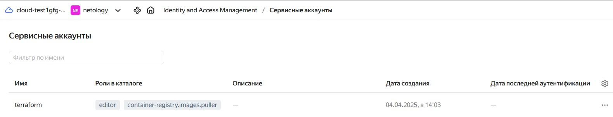
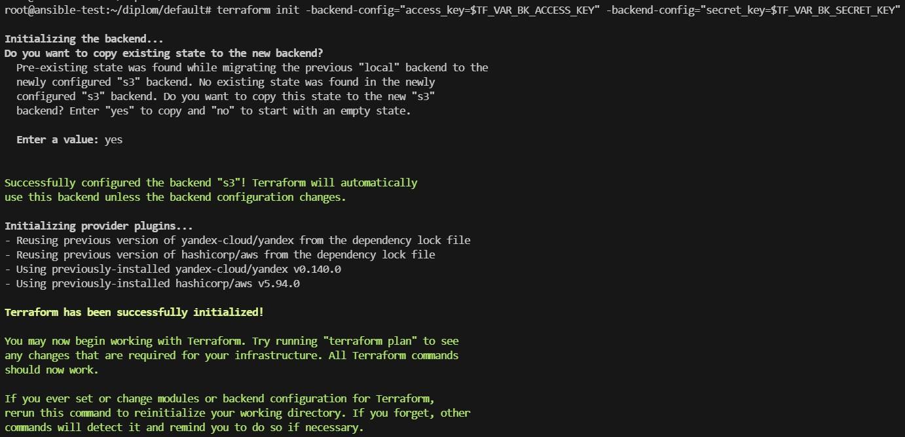
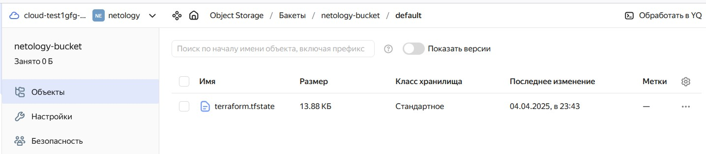
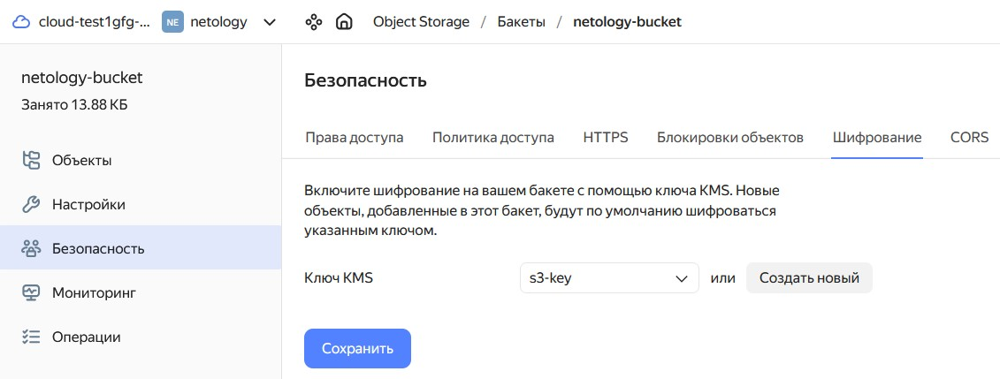
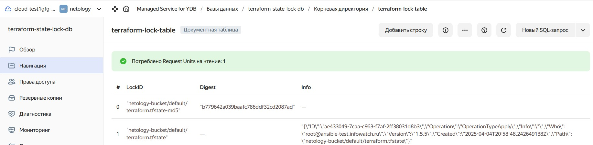
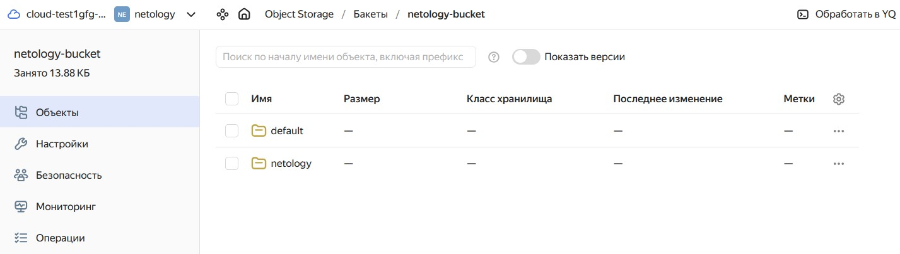
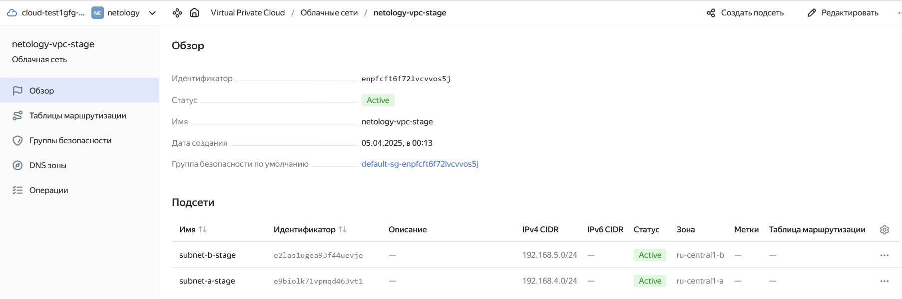

### Создание облачной инфраструктуры

1. Создайте сервисный аккаунт, который будет в дальнейшем использоваться Terraform для работы с инфраструктурой с необходимыми и достаточными правами. Не стоит использовать права суперпользователя
2. Подготовьте [backend](https://www.terraform.io/docs/language/settings/backends/index.html) для Terraform:  
   а. Рекомендуемый вариант: [Terraform Cloud](https://app.terraform.io/)  
   б. Альтернативный вариант: S3 bucket в созданном ЯО аккаунте
3. Настройте [workspaces](https://www.terraform.io/docs/language/state/workspaces.html)  
   а. Рекомендуемый вариант: создайте два workspace: *stage* и *prod*. В случае выбора этого варианта все последующие шаги должны учитывать факт существования нескольких workspace.  
   б. Альтернативный вариант: используйте один workspace, назвав его *stage*. Пожалуйста, не используйте workspace, создаваемый Terraform-ом по-умолчанию (*default*).
4. Создайте VPC с подсетями в разных зонах доступности.
5. Убедитесь, что теперь вы можете выполнить команды `terraform destroy` и `terraform apply` без дополнительных ручных действий.
6. В случае использования [Terraform Cloud](https://app.terraform.io/) в качестве [backend](https://www.terraform.io/docs/language/settings/backends/index.html) убедитесь, что применение изменений успешно проходит, используя web-интерфейс Terraform cloud.

Ожидаемые результаты:

1. Terraform сконфигурирован и создание инфраструктуры посредством Terraform возможно без дополнительных ручных действий.
2. Полученная конфигурация инфраструктуры является предварительной, поэтому в ходе дальнейшего выполнения задания возможны изменения.

### Выполнение этапа

Так как в дальнейшем мы будем создавать инфраструктуру в зависимости от выбранного Workspace, в рабочем каталоге создаем проект `default`, где мы опишем и создадим следующие ресурсы:

- Сервисный аккаунт
- Необходимые роли
- S3 bucket
- Бессерверную БД типа DynamoDB
- Симметричный ключ для шифрования объектов S3 bucket

Создаем Folder `netology` и сервисный аккаунт `terraform` с необходимыми и достаточными правами которые в дальнейшем будут использоваться Terraform для работы с инфраструктурой.

Инициализируем рабочий каталог:

`terraform init`

**Примечание**. Последующие команды `terraform` будут выполняться каждый раз при добавлении, изменении или удалении конфигурации.

Выполняем запуск планирования для проверки конфигурации:

`terraform plan`

Создаем ресурсы:

`terraform apply`

После создания сервисного аккаунта производим настройку профиля CLI для выполнения операций от имени сервисного аккаунта.

		<!---->

Создаем авторизованный ключ для сервисного аккаунта и запишем его файл:
```
yc iam key create \
  --service-account-id <service_account_id> \
  --folder-name netology \
  --output key.json
```

Создаем профиль, который будет использоваться для выполнения операций от имени сервисного аккаунта:

`yc config profile create terraform`

Задаем конфигурацию профиля:
```
yc config set service-account-key key.json
yc config set cloud-id <cloud id>
yc config set folder-id <folder id>
```

Теперь вы можете получить IAM-токен для сервисного аккаунта с помощью команды `yc iam create-token`.

Добавляем аутентификационные данные в переменные окружения:
```
export YC_TOKEN=$(yc iam create-token)
export YC_CLOUD_ID=$(yc config get cloud-id)
export YC_FOLDER_ID=$(yc config get folder-id)
```

Создаем Bucket. Для этого создадим статический ключ доступа для сервисного аккаунта terraform с помощью ресурса `yandex_iam_service_account_static_access_key` и укажем ключи в аргументах `access_key` и `secret_key` в конфигурации и Bucket. Добавим шифрование объектов с помощью сервиса KMS. Необходимо записать значения `access_key` и `secret_key` для дальнейшего экспорта в качестве переменных окружения.

Создаем бессерверную БД типа DynamoDB `terraform-state-lock-db`, в которой Terraform будет фиксировать блокировки. Создадим документную таблицу `terraform-lock-table` с колонкой LockID типа String, которая будет являться ключом партиционирования.

Для создания объектов хранения укажем в переменных окружения статический ключ:
```
export TF_VAR_BK_ACCESS_KEY=<access_key>
export TF_VAR_BK_SECRET_KEY=<secret_key>
```

Добавляем конфигурацию Backend. В блоке `backend` указываем в атрибуте `endpoints.dynamodb` ID DynamoDB`terraform-state-lock-db`:

`https://docapi.serverless.yandexcloud.net/ru-central1/<>folder_id/dynamodb_id`

Затем выполняем инициализацию Backend в проекте `default`:

`terraform init -backend-config="access_key=$TF_VAR_BK_ACCESS_KEY" -backend-config="secret_key=$TF_VAR_BK_SECRET_KEY"`

Результат:

		<!---->

		<!---->

		<!---->

		<!---->

В проекте `default` создадим файл `outputs.tf`, в котором будем определять выходные данные ресурсов для использования в проекте `netology`.

В рабочем каталоге создаем директорию `netology`, в которой будет размещаться конфигурация проекта, файл с конфигурацией terraform и инициализируем директорию:

`terraform init -backend-config="access_key=$TF_VAR_BK_ACCESS_KEY" -backend-config="secret_key=$TF_VAR_BK_SECRET_KEY"
`

		<!---->

Создаем два workspace:
```
terraform workspace new prod
terraform workspace new stage
```

Переключаемся на workspace stage:

`terraform workspace select stage`

**Примечание.** Последующие ресурсы будут создаваться в соответствии с выбранным workspace. Получать необходимые ресурсы из проекта `default` будем с помощью Data source `terraform_remote_state`.

Создаем VPC с подсетями в разных зонах доступности c помощью манифеста `vpc.tf`:

`terraform apply`

		<!---->
