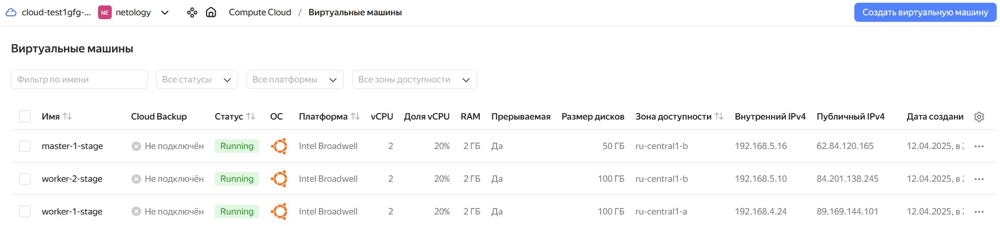
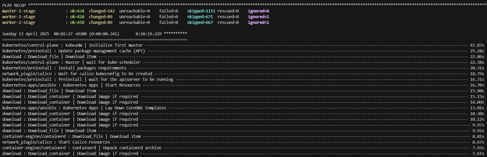
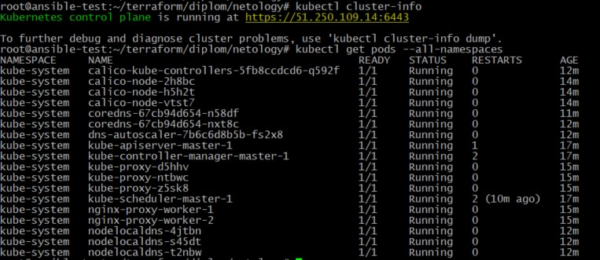

### Создание Kubernetes кластера

На этом этапе необходимо создать [Kubernetes](https://kubernetes.io/ru/docs/concepts/overview/what-is-kubernetes/) кластер на базе предварительно созданной инфраструктуры.   Требуется обеспечить доступ к ресурсам из Интернета.

Это можно сделать двумя способами:

1. Рекомендуемый вариант: самостоятельная установка Kubernetes кластера.  
   а. При помощи Terraform подготовить как минимум 3 виртуальных машины Compute Cloud для создания Kubernetes-кластера. Тип виртуальной машины следует выбрать самостоятельно с учётом требовании к производительности и стоимости. Если в дальнейшем поймете, что необходимо сменить тип инстанса, используйте Terraform для внесения изменений.  
   б. Подготовить [ansible](https://www.ansible.com/) конфигурации, можно воспользоваться, например [Kubespray](https://kubernetes.io/docs/setup/production-environment/tools/kubespray/)  
   в. Задеплоить Kubernetes на подготовленные ранее инстансы, в случае нехватки каких-либо ресурсов вы всегда можете создать их при помощи Terraform.
2. Альтернативный вариант: воспользуйтесь сервисом [Yandex Managed Service for Kubernetes](https://cloud.yandex.ru/services/managed-kubernetes)  
  а. С помощью terraform resource для [kubernetes](https://registry.terraform.io/providers/yandex-cloud/yandex/latest/docs/resources/kubernetes_cluster) создать региональный мастер kubernetes с размещением нод в разных 3 подсетях      
  б. С помощью terraform resource для [kubernetes node group](https://registry.terraform.io/providers/yandex-cloud/yandex/latest/docs/resources/kubernetes_node_group)

Ожидаемый результат:

1. Работоспособный Kubernetes кластер.
2. В файле `~/.kube/config` находятся данные для доступа к кластеру.
3. Команда `kubectl get pods --all-namespaces` отрабатывает без ошибок.

### Выполнение этапа

Для развертывания Kubernetes-кластера будем использовать ресурсы `yandex_compute_instance_group` отдельно как для Masters, так и для Workers нод, определенные в файле `vm.tf`.

Для доступности приложения извне будем разворачивать `Network Load Balancer` Яндекс облака, определенный в файле `nlb.tf`.

Выполнем развертывание виртуальных машиин:

`terraform apply`

		<!---->

Клонируем репозиторий с Kubespray:

`git clone https://github.com/kubernetes-sigs/kubespray`

Установим зависимости:

`pip3 install -r requirements.txt`

Переходим в каталог Kubespray и скопируем шаблон, содержащий `group_vars` и сконфигурируем под себя:

`cp -rfp inventory/sample inventory/ntlg_cluster/`

**Примечание.** Файл Ansible inventory создаем с помощью ресурсов Terraform `template_file` и `null_resource`. Не забываем проверить значение параметра `supplementary_addresses_in_ssl_keys`. Этот параметр необходим для подключения
к кластеру извне.

Переходим в каталог Kubespray и запускаем создание кластера:

```
cd kubespray/

ansible-playbook -u ubuntu -i inventory/ntlg_cluster/inventory.ini --become --become-user=root cluster.yml
```

		<!---->

После создания кластера подключаемся к `master-1` и копируем файл `/etc/kubernetes/admin.conf` в `~/.kube/config` в качестве kubeconfig для подключения к кластеру Kubernetes:  

`ssh k8smaster 'sudo cat /etc/kubernetes/admin.conf' > $HOME/.kube/config`

Меняем в `~/.kube/config` IP адрес для подключения к кластеру c 127.0.0.1 на внешний:

`server: https://<master_ip>:6443`

Проверяем подключение и работоспособность кластера Kubernetes:

`kubectl cluster-info`  
`kubectl get pods --all-namespaces`

		<!---->


