### Установка и настройка CI/CD

Осталось настроить ci/cd систему для автоматической сборки docker image и деплоя приложения при изменении кода.

Цель:

1. Автоматическая сборка docker образа при коммите в репозиторий с тестовым приложением.
2. Автоматический деплой нового docker образа.

Можно использовать [teamcity](https://www.jetbrains.com/ru-ru/teamcity/), [jenkins](https://www.jenkins.io/), [GitLab CI](https://about.gitlab.com/stages-devops-lifecycle/continuous-integration/) или GitHub Actions.

Ожидаемый результат:

1. Интерфейс ci/cd сервиса доступен по http.
2. При любом коммите в репозиторие с тестовым приложением происходит сборка и отправка в регистр Docker образа.
3. При создании тега (например, v1.0.0) происходит сборка и отправка с соответствующим label в регистри, а также деплой соответствующего Docker образа в кластер Kubernetes.

### Выполнение этапа

#### Развертывание Jenkins

Добавляем репозиторий с чартом Jenkins:  
```
helm repo add jenkinsci https://charts.jenkins.io
helm repo update
```

Создаем Secret для использования SSL сертификатов:  
```
kubectl create ns jenkins
kubectl create secret tls jenkins-secret-tls -n jenkins --key=/etc/ssl/private.key --cert=/etc/ssl/cert.crt
```

Создаем Secret с учетными данными для аутентификации в Docker Hub:
 
```
kubectl create secret docker-registry dockercred -n jenkins \
    --docker-server=https://index.docker.io/v1/ \
    --docker-username=<user> \
    --docker-password=<password>\
    --docker-email=<email>
```

Создаем Service Account для развертывания приложения:

`kubectl apply -f jenkins-sa.yaml`

Создаем постоянное хранилище:  
`kubectl apply -f jenkins-volume.yaml`

В репозитории с исходниками приложения [app-netology](https://github.com/owirtifo/app-netology) создаем `Webhook`, чтобы иметь возможность запускать сборку при изменении репозитория. В поле `Payload URL` указываем `token` для  проверки подлинности вебхуков, которые Jenkins будет получать от хоста Git. Обязательно добавьте `/generic-webhook-trigger/invoke?token=<token>` в конец своего URL. Выбираем `Just the push event`.

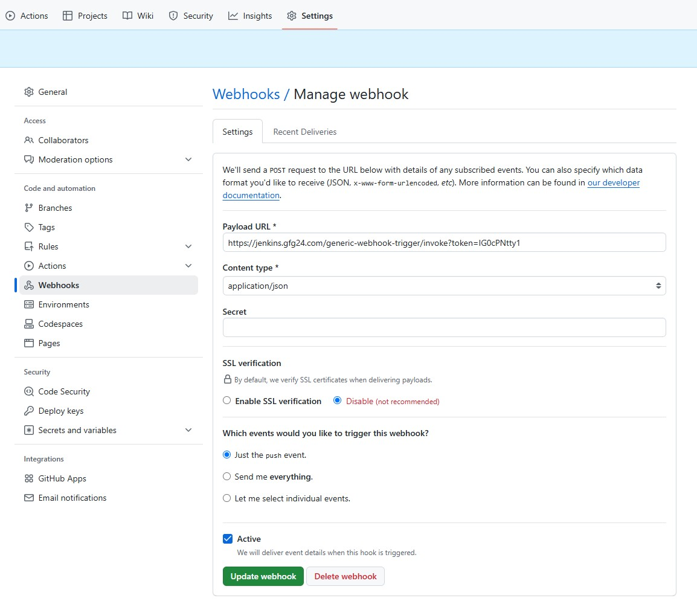		<!---->


**Примечание.** В файле `jenkins-values.yaml` проекта `netology` в настройке `pipelineJob.triggers.genericTrigger.token` конфигурации `JCasC` необходимо указать такой же `token`, что и в поле `Payload URL` создании вебхука в GitHub:

```
  JCasC:
    defaultConfig: true
    configScripts:
     welcome-message: |
       jenkins:
         systemMessage: This is Netology App.
       jobs:
        - script: >
            pipelineJob('app-pipeline-job') {
              triggers {
                genericTrigger {
                  token('<token>')
```

Разворачиваем Jenkins:  
`helm upgrade --install jenkins jenkinsci/jenkins -n jenkins -f jenkins-values.yaml`

Проверяем:

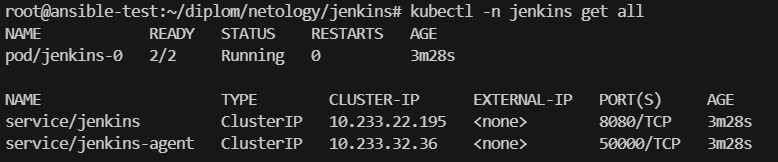		<!---->

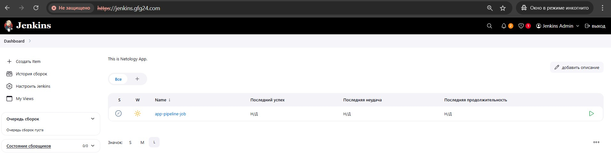		<!---->

#### Проверка работы Pipline

1. При любом коммите в репозитории с тестовым приложением происходит сборка и отправка в регистр Docker образа.

Изменяем код в репозитории с исходниками приложения [app-netology](https://github.com/owirtifo/app-netology) и пушим.  

**Примечание**. В этом примере не создаем тег.  

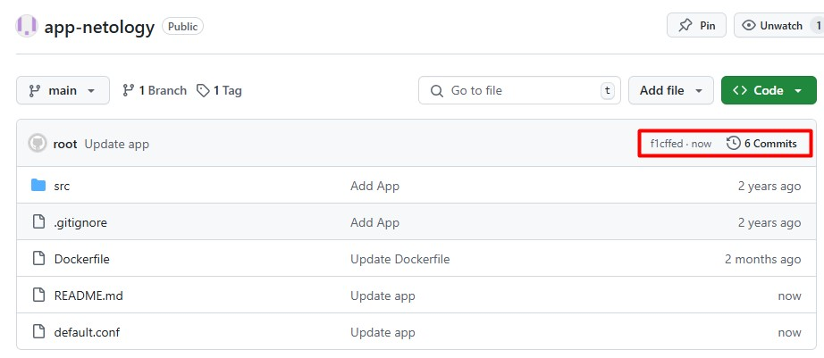		<!---->

Видим что автоматически запустился Pipeline через настроенный Webhook:

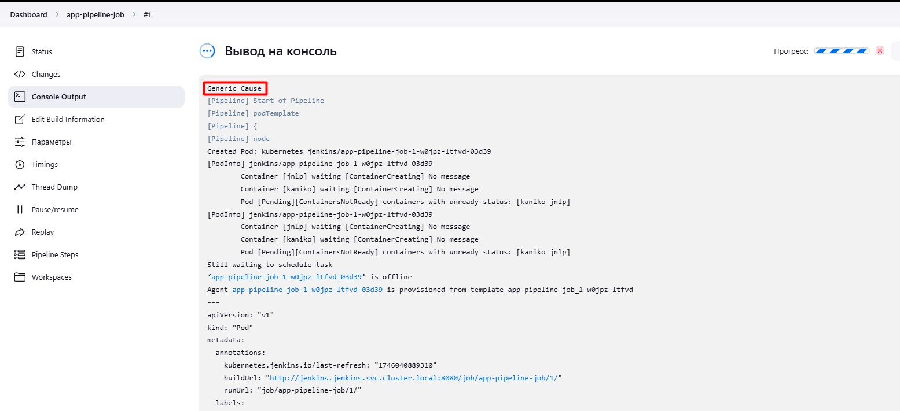		<!---->

Проверяем результат сборки:

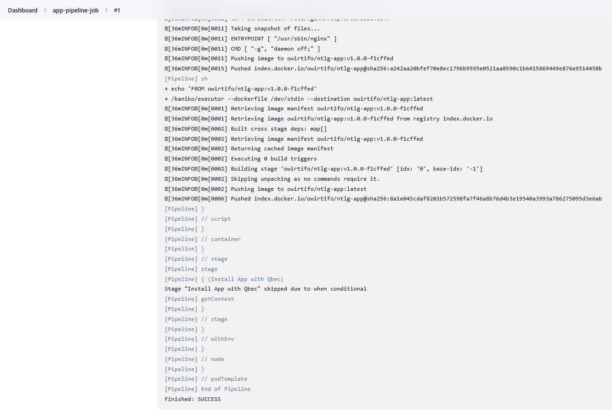		<!---->

DokerHub репозиторий:

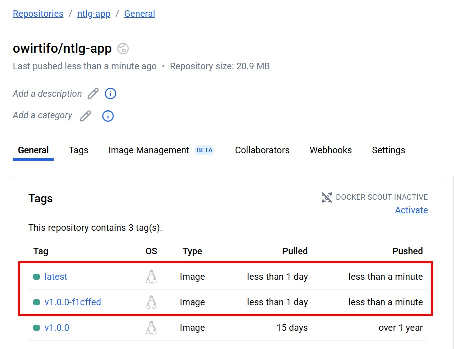		<!---->

В репозиторий DokerHub пушится образ с 2-мя тегами: `latest` и `на основе коммита в Git`.

2. При создании тега (например, v1.0.0) происходит сборка и отправка с соответствующим label в регистри, а также деплой соответствующего Docker образа в кластер Kubernetes.

Изменяем код в репозитории с исходниками приложения [app-netology](https://github.com/owirtifo/app-netology), создаем тег `v2.0.0` и пушим:

`git push --follow-tags`

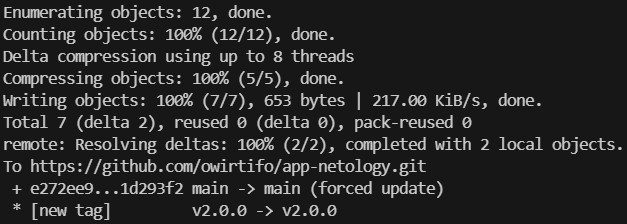		<!---->

Видим что автоматически запустился Pipeline через настроенный Webhook:

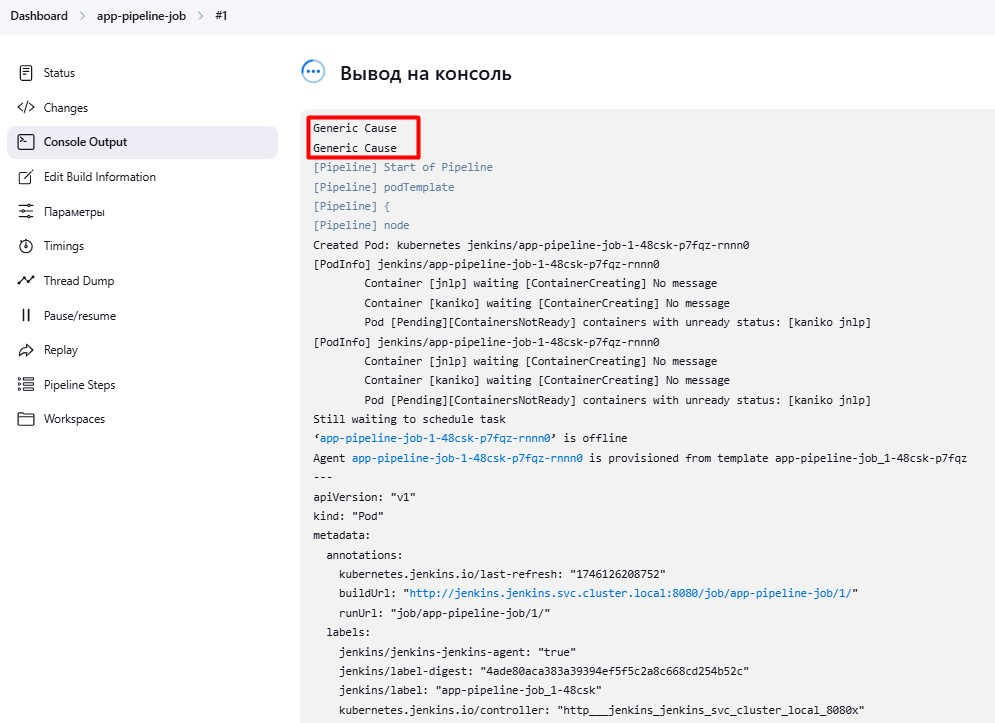		<!---->

**Примечание**. Так как был пуш коммита и тега, то отправилось 2 вэбхука.  

DokerHub репозиторий:

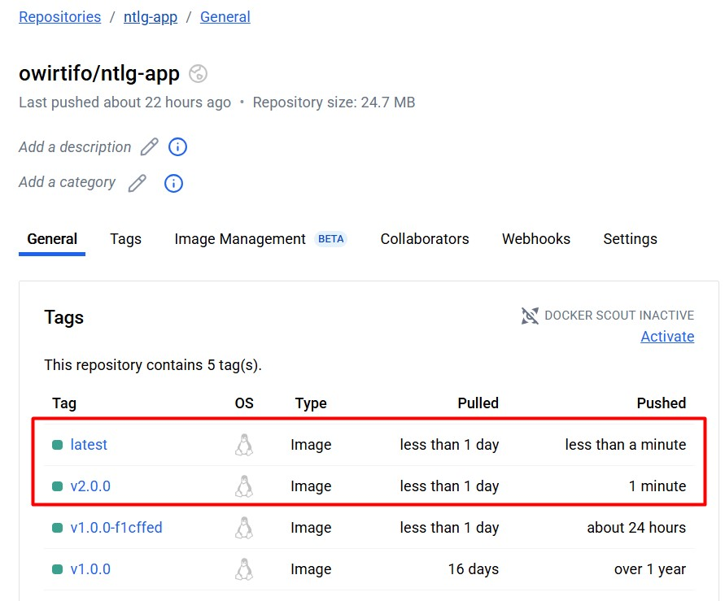		<!---->

В репозиторий DokerHub пушится образ с 2-мя тегами: `latest` и `на основе коммита в Git`.

Проверяем результат сборки:

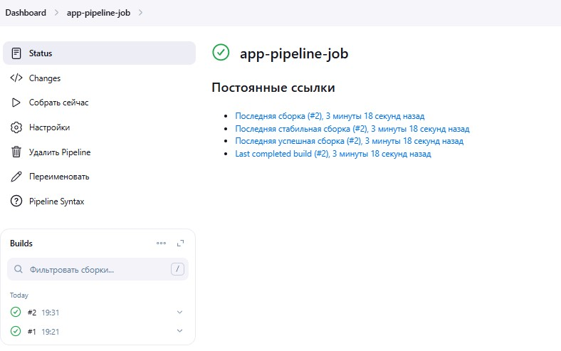		<!---->

Проверка приложения с новым тегом:

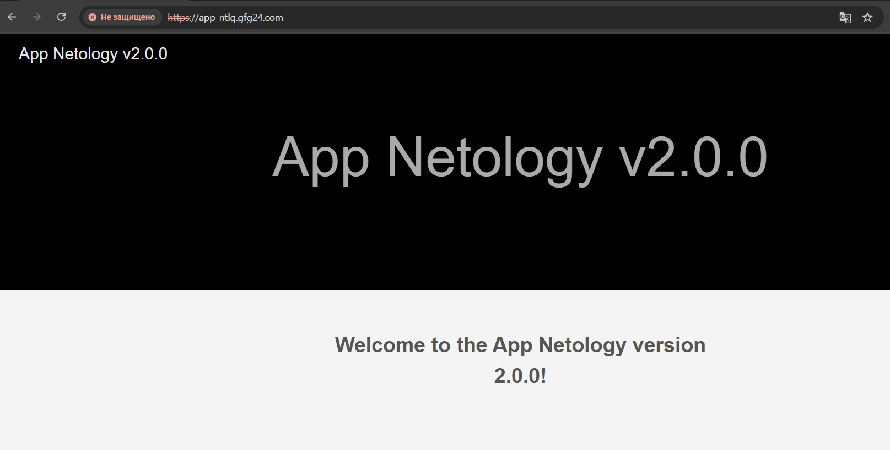		<!---->